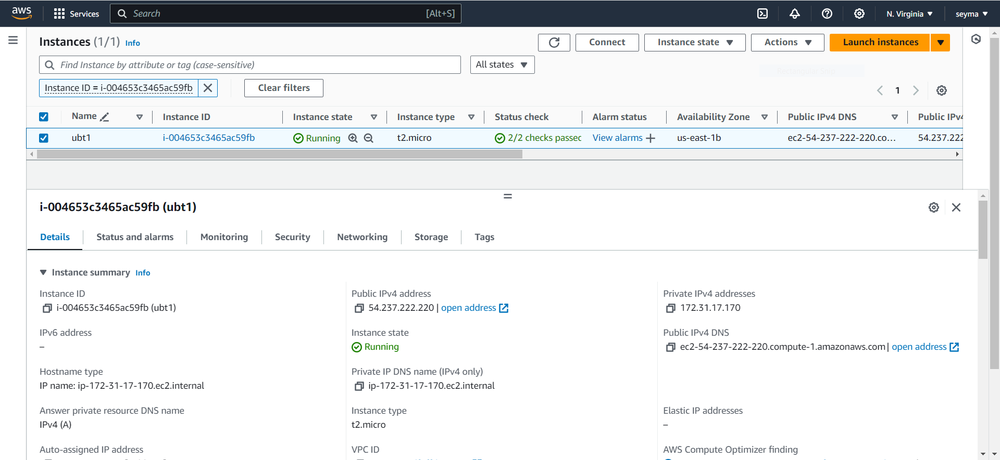
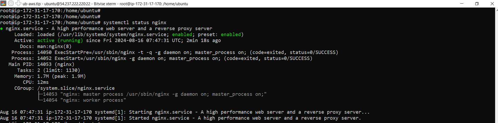
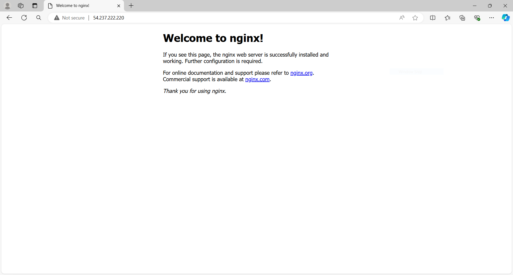
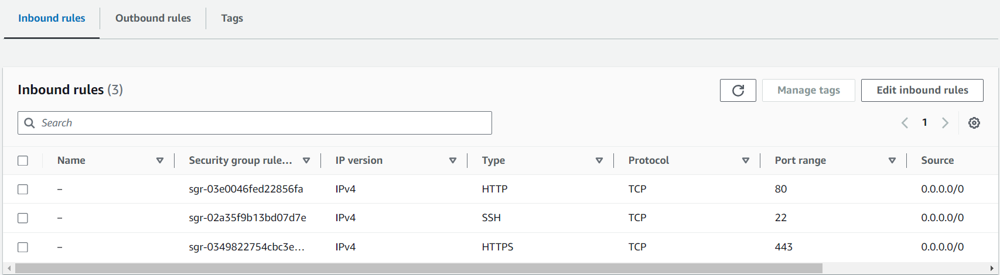
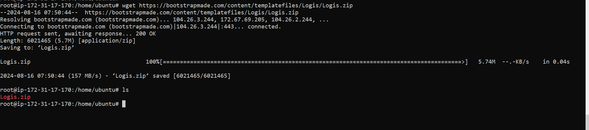
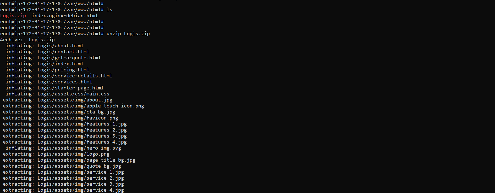
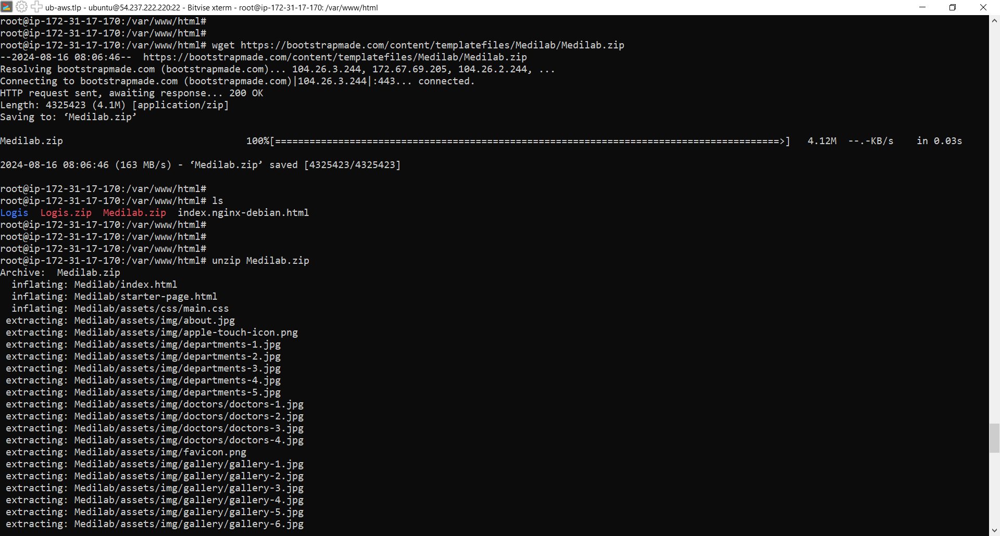
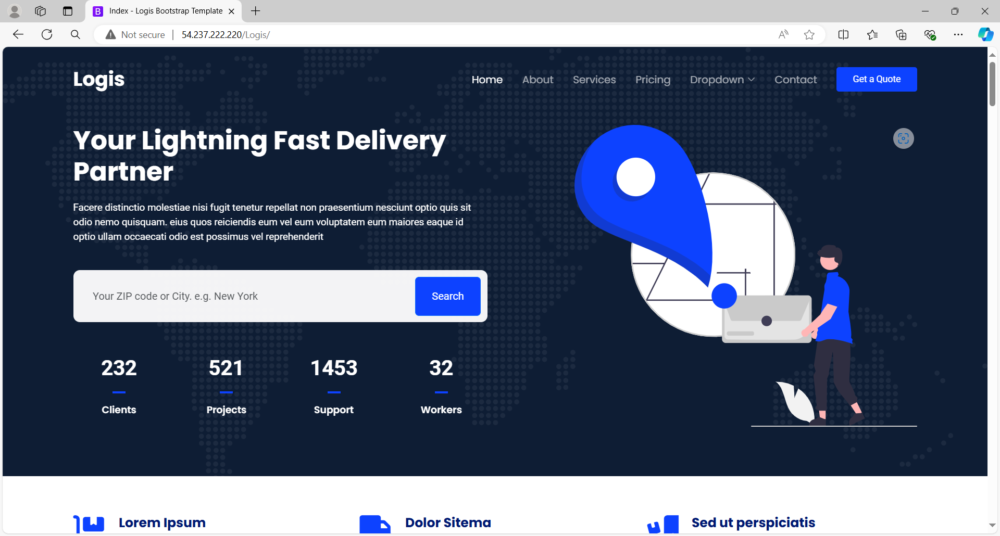
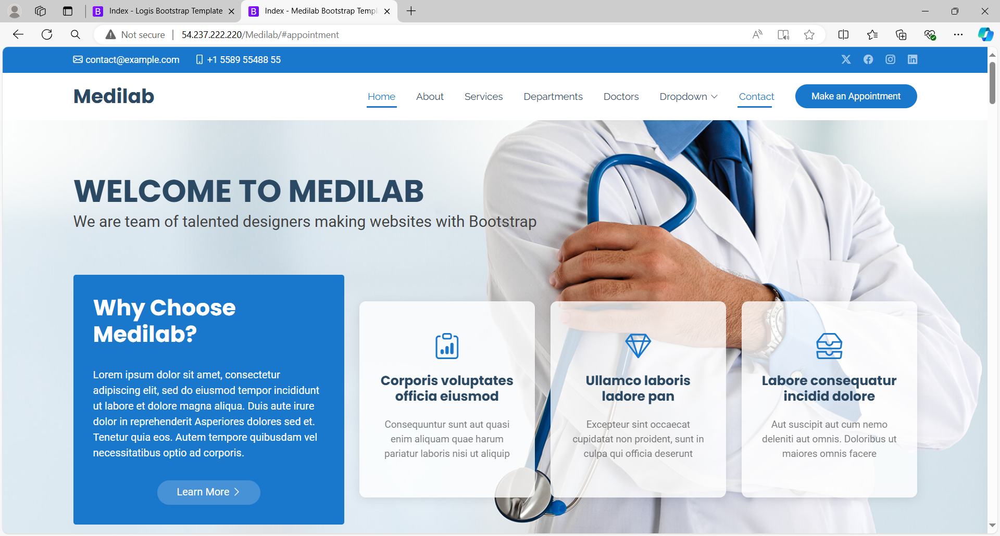

# NGINX Server Setup on AWS EC2 with Bootstrap Templates

This guide explains the steps to set up an NGINX server on an AWS Free Tier Ubuntu EC2 instance, and deploy two Bootstrap templates. Follow the steps below to replicate the setup.

## Steps

### 1. Create an EC2 Instance

1. **Log in to your AWS Management Console**.
2. **Navigate to the EC2 Dashboard** and click on **Launch Instance**.
3. **Choose the Ubuntu AMI** (Amazon Machine Image).
4. **Select an Instance Type** (e.g., t2.micro for Free Tier).
5. **Configure Instance Details**, including network settings.
6. **Add Storage** as needed.
7. **Add Tags** if desired.
8. **Configure Security Group** to allow HTTP and HTTPS traffic.
   - **Port 80 (HTTP)**
   - **Port 443 (HTTPS)**
9. **Review and Launch** the instance, and then **Connect** to it using SSH.

**EC2 Instance Setup**


### 2. Install NGINX

1. **Connect to your EC2 instance** via SSH.
2. **Update the package list**:

   ```bash
   sudo apt update
   sudo apt upgrade -y
   ```

3. **Install NGINX**:

   ```bash
   sudo apt install nginx
   ```

4. **Check the status of NGINX** to ensure it was running:

   ```bash
   sudo systemctl status nginx
   ```

     

   If NGINX was not running, started it and enabled it to start on boot with the following commands:

   ```bash
   sudo systemctl start nginx
   sudo systemctl enable nginx
   ```

5. Verify NGINX installation by visiting http://<EC2_PUBLIC_IP> in browser. The NGINX default welcome page was displayed.

   

### 3. Configure HTTP and HTTPS Permissions

1. **Modify Security Group settings** to allow inbound traffic on ports 80 and 443.

   - Go to the **EC2 Dashboard**.
   - Select **Security Groups**.
   - Edit the inbound rules of your security group to include `HTTP` and `HTTPS`.

   

### 4. Deploy Bootstrap Templates

1. Download the Bootstrap templates using `wget`:

   ```bash
   cd /var/www/html
   sudo wget <template_url>
   ```

   

2. Unzip the downloaded files:

   ``` bash
   sudo apt install unzip
   sudo unzip <template_file>
   ```

   

   

3. Test the deployment by accessing:

   - http://<EC2_PUBLIC_IP>/Medilab

   - http://<EC2_PUBLIC_IP>/Logis

    **Logis**
   

   **Medilab**
   
